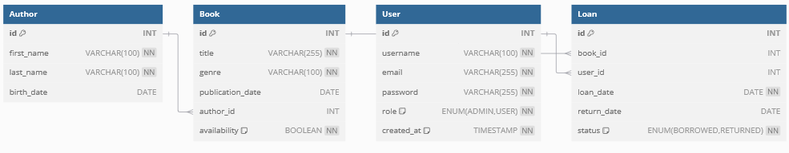

# API de Gestion de Bibliothèque

## Description du Projet
Cette API RESTful, développée avec Symfony, permet de gérer une bibliothèque. Elle inclut la gestion des livres, auteurs, utilisateurs, et des prêts de livres. L'API est sécurisée via l'authentification JWT et permet de suivre les disponibilités des livres en temps réel.

### Fonctionnalités principales :
- Gestion des opérations CRUD pour les livres, auteurs, utilisateurs.
- Suivi des prêts et des retours de livres avec gestion des disponibilités.
- Authentification des utilisateurs via JSON Web Tokens (JWT).
- Recherche avancée de livres par titre, auteur, genre, et disponibilité.

### Schéma de base de données

